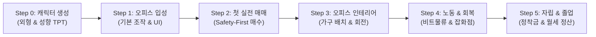

# StockWars GDD: CORE_GDD_10. 튜토리얼 시스템 (Tutorial System)

**버전:** v2.0.0 (핵심 경험 우선 배치 및 온보딩 개편본)  
**기능:** 신규 트레이더 정착을 위한 강제 가이드(Railroad) 시퀀스, 핵심 매매 경험 우선 전달 및 보상 체계 명세

---

## 1. 개요 및 설계 철학

### 1.1. 설계 철학: Core Hook First (핵심 재미의 즉시성)
- **문제 인식**: 기존의 "노동(알바) $\rightarrow$ 기력 회복 $\rightarrow$ 첫 매매" 순서는 주식 시뮬레이션 게임을 기대하고 접속한 유저에게 부차적인 노동과 피로도를 먼저 강요하여 초반 이탈률(Drop-off)을 높이는 위험이 있었습니다.
- **개편 방향**: 캐릭터 생성 직후, 오피스 기본 조작을 익히자마자 **'첫 실전 매매'**의 짜릿한 체결 경험을 최우선으로 제공합니다. 
- 이후 "더 많은 시드를 모으기 위한 노동(비트 물류)"과 "기력 회복", "오피스 꾸미기"를 자연스러운 확장 콘텐츠로 학습하도록 설계합니다.

### 1.2. 튜토리얼 원칙: Railroad Tutorial
- **UI 포커싱 & 마스킹**: 단계별로 안나가 지시하는 필수 인터랙션 버튼 외의 모든 불필요한 UI와 월드 이동은 비활성화(Gray-out & Click Block) 처리됩니다.
- **순차적 기능 해금**: 각 단계를 완수할 때마다 관련 시스템(주식 시장, 가구 배치, 타운 외출, 노동 등)이 순차적으로 개방됩니다.
- **이벤트 버스 연동**: `TUTORIAL_STEP_COMPLETE` 이벤트를 통해 상태가 서버 및 로컬에 안전하게 저장됩니다.

---

## 2. 튜토리얼 단계별 시나리오 (6-Step Sequence)

---

### [Step 0] 트레이더 등록 (캐릭터 생성 및 성향 테스트)
- **참조 문서**: [CORE_GDD_08: 캐릭터 생성 시스템](file:///c:/Users/Administrator/Documents/GitHub/StockWars/Docs/CORE_GDD_08_CharacterCreation.md)
- **목표**: 플레이어의 고유 아바타 아이덴티티 및 초기 투자 성향 확립.
- **진행 흐름**:
    1. **외형 설정**: 성별, 피부톤(5종), 헤어(4종), 기본 의상 선택.
    2. **트레이더 성향 테스트(TPT)**: 3가지 질문 답변을 통해 4대 능력치(분석력/협상력/운용력/회복력) 중 1개에 **+1 블록** 보너스 부여.
    3. **트레이더 출입증 발급 연출**: 도트 프린터 효과음과 함께 닉네임, 사진, 성향이 각인된 '트레이더 출입증' 슬라이드 업.
    4. 출입증 터치 시 홈 오피스 씬으로 페이드 인.
- **초기 자산**: 현금 **5,000G** 지급 (계좌 입금).

---

### [Step 1] 오피스 입성 및 기본 조작 오리엔테이션
- **목표**: 2.5D 아이소메트릭 오피스 조작법, 시점 컨트롤 및 핵심 HUD 인지.
- **액션**:
    1. 안나(Anna)의 환영 대사(`TUT_01_WELCOME`) 출력 ("환영해요, 파트너! 여기가 앞으로 우리가 함께할 트레이딩룸이에요.")
    2. **오피스 명칭 설정**: 팝업에서 아지트 이름 입력 및 중앙 현판 반영.
    3. **기본 조작 가이드**:
        - 캐릭터 이동 (WASD / 마우스 클릭)
        - 카메라 이동 및 줌 인/아웃 (마우스 휠)
        - 상단 HUD 확인 (현재 보유 현금 5,000G, 스테미나 바, 실시간 서버 시계)
        - 하단/측면 스마트폰 메신저(Bubble) 알림 확인
- **완료 조건**: 오피스 중앙의 트레이딩 데스크/모니터 앞 지정 구역으로 이동 완료.

---

### [Step 2] 첫 실전 매매 (주주가 되다 - Core Hook)
- **목표**: HTS/주식 인터페이스 학습 및 첫 매수 체결의 쾌감 전달.
- **액션**:
    1. 안나의 매매 가이드 대사(`TUT_02_TRADE_START`) 출력 ("첫 투자는 가장 확실하고 안전한 기업부터 시작해 봐요.")
    2. 모니터를 클릭하여 [주식 거래소] 화면 오픈.
    3. 시스템이 추천하는 **[Safety-First] 우량 저평가주** 상세 차트 확인.
    4. **1주 매수(Buy 1 Share)** 실행 $\rightarrow$ 도트 호가창 체결 연출 및 효과음 출력.
    5. 보유 주식 탭(Portfolio)에서 내가 매수한 주식과 실시간 수익률 바 확인.
- **종목 추천 및 안전망 로직 (Safety-First)**:
    - 변동성 등급이 가장 낮은(Low Risk) 종목 중 현재 시장가가 가장 저렴한 종목을 매칭.
    - 만약 주가가 5,000G를 초과할 경우, 안나의 특별 지원금 대사(`TUT_02_SUBSIDY`)와 함께 차액 지원.
- **제약**: 매수 수량 1주로 고정 락(Lock), 매도 버튼은 튜토리얼 중 비활성화.
- **기획 의도**: 게임 시작 3분 이내에 주식 매수의 재미와 피드백을 전달하여 몰입도 극대화.

---

### [Step 3] 나만의 공간 (가구 배치 및 인테리어)
- **목표**: 2.5D 아이소메트릭 오피스 커스터마이징 및 가구 회전/배치 시스템 학습.
- **액션**:
    1. 안나의 공간 관리 대사(`TUT_03_FURNITURE`) 출력 ("우리의 업무 환경도 중요해요. 기본 가구를 원하는 위치에 배치해 볼까요?")
    2. 우측 상단 [인테리어 모드(Edit Mode)] 버튼 클릭 강제.
    3. 바닥 그리드 활성화 $\rightarrow$ 가구 보관함 서랍(Drawer) 오픈.
    4. 기본 지급된 '스타터 오피스 체어' 또는 '모니터 데스크'를 드래그하여 그리드 위에 배치.
    5. **회전 기능(R키 / 회전 버튼)**을 눌러 90도 회전 1회 수행 후 [배치 완료] 버튼 클릭.
- **기획 의도**: 공간에 대한 애착을 형성하고 쾌적한 오피스 환경이 주는 버프 효과의 기초를 인지시킴.

---

### [Step 4] 시드머니 확충과 기력 관리 (노동 & 회복 루프)
- **목표**: 투자 시드가 부족할 때의 자금 조달 수단(비트 물류)과 스테미나 회복(잡화점) 사이클 학습.
- **액션**:
    1. 안나의 외출 제안 대사(`TUT_04_GO_TOWN`) 출력 ("더 큰 종목을 매수하려면 시드가 더 필요해요. 타운의 물류 센터로 가볼까요?")
    2. 타운 맵을 열어 **[비트 물류]**로 강제 이동.
    3. 노동 미니게임 1회 실행 $\rightarrow$ 결과 등급에 따른 급여 수령 (S: 800G / A: 560G / B: 320G).
    4. 미니게임 후 소모된 스테미나를 확인한 안나의 안내(`TUT_04_STAMINA_HEAL`) 출력.
    5. 인접한 **[비비안 잡화점]**으로 이동하여 에너지 드링크(500G) 1개 구매 및 인벤토리에서 즉시 사용.
- **기획 의도**: 노동을 통한 초기 자본 축적과 스테미나 관리의 필요성을 하나의 자연스러운 외출 흐름으로 묶어 체득시킴.

---

### [Step 5] 독립 (Graduation) 및 첫 주간 월세 정산 과제 (데모 완결 목표)
- **목표**: 전체 시스템 자유도 부여, 첫 주간 생존 목표 수립 및 **데모 빌드 최종 목표 달성**.
- **액션**:
    1. 홈 오피스 귀환 $\rightarrow$ 안나의 졸업 축하 대사(`TUT_05_GRADUATION`) 출력.
    2. **정착 보너스 2,000G** 추가 지급 및 `Tutorial_Completed = true` 저장.
    3. 모든 UI 락 해제 (타운 전체 시설, 자유 매매, 대출 은행, 찌라시 등 완전 개방).
- **데모 완결 목표 (Demo Completion Specification)**:
    - 본 데모 빌드는 '플레이어 레벨'이 아닌 **'첫 주간 정산(First Settlement)' 완수**를 데모 종료 시점으로 규정합니다.
    - **목표 부여**: "7일간의 거래를 통해 첫 정산일 전까지 **월세/부채 정착금 5,000G 확보하기**".
    - **데모 종료 분기 로직**:
        1. **정상 정산 완수 (Normal Settlement Completion)**:
            - 게임 내 7일(1주) 경과 시 `WeeklySettlementEvent` 발생 $\rightarrow$ `[주간 투자 성과 보고서 UI]` 출력.
            - **성공 (Success)**: 정산 후 최종 잔고 $\ge$ 5,000G ➔ S / A / B 등급 부여 및 **"데모 클리어 (Demo Success)"** 엔딩.
            - **실패 (Fail)**: 정산 후 최종 잔고 < 5,000G ➔ **"파산 및 게임 오버 (Bankruptcy)"** 엔딩.
        2. **조기 파산 (Early Bankruptcy - Game Over)**:
            - 7일차 정산일 이전이라도 과도한 대출/폭락으로 인해 `[현금 0원 이하 & 보유 주식 0원]` (완전 자본 잠식) 도달 시 즉시 채권 압류 팝업 출력 후 **"조기 파산 데모 종료"**.
            - *(참고: 3일차 등 조기 성취 시에도 시장 리스크 관리 심리 유지를 위해 정산일까지 주식 매매가 계속 진행됨)*
        3. **시연 전용 핫키 / 타임 스킵 (Dev Demo Skip)**:
            - 발표 및 테스트 편의성을 위해 시연 모드에서는 즉시 7일차 정산 리포트로 워프하는 개발자 스킵 기능 제공.

---

## 3. 다이얼로그 테이블 연동 (Anna Dialogue Key)

| Step | 다이얼로그 ID | 표정 | 대사 요약 |
| :--- | :--- | :---: | :--- |
| **Step 0** | `TUT_00_ID_CARD` | Smile | "환영합니다, [Name] 트레이더님. 당신의 전용 출입증이 발급되었습니다." |
| **Step 1** | `TUT_01_WELCOME` | Happy | "어서 와요, 파트너! 이곳이 바로 우리 둘만의 트레이딩룸이에요. 멋진 이름을 지어주세요!" |
| **Step 2** | `TUT_02_TRADE_START` | Smile | "백문이 불여일견! 시장이 열려있을 때 첫 주식을 매수해 봐요. 가장 안전한 기업을 골라뒀어요." |
| **Step 2 (예외)** | `TUT_02_SUBSIDY` | Smile | "자금이 살짝 부족하네요? 첫 투자를 위해 제가 특별 지원금을 보태드릴게요!" |
| **Step 3** | `TUT_03_FURNITURE` | Standard | "트레이더의 집중력은 쾌적한 오피스에서 나와요. 기본 가구를 마음에 드는 곳에 놓아보세요." |
| **Step 4** | `TUT_04_GO_TOWN` | Standard | "더 큰 기회를 잡으려면 시드가 필요하죠. 비트 물류에서 정당한 노동의 대가를 얻어볼까요?" |
| **Step 4** | `TUT_04_STAMINA_HEAL` | Pain | "체력이 많이 떨어졌네요! 비비안 잡화점에서 시원한 음료 한 캔으로 기력을 충전해요." |
| **Step 5** | `TUT_05_GRADUATION` | Happy | "완벽해요! 이제 당신은 당당한 독립 트레이더예요. 정착 보너스와 함께 당신의 항해를 응원할게요!" |
| **Step 5 (과제)** | `TUT_06_SETTLEMENT_GOAL` | Smile | "매주 월요일엔 오피스 월세 정산이 있어요. 72시간의 유예가 있으니 차근차근 5,000G를 준비해 봐요." |

---

## 4. 기술적 구현 및 예외 처리 명세

### 4.1. UI 펀칭 마스크 (Punch-through Mask)
- 캔버스 최상단에 반투명 딤드(Dimmed) 패널(`TutorialMask`)을 배치하고 지정된 타겟 RectTransform 영역만 투과(Punch) 처리.
- 펄스 애니메이션(Pulse Tween) 및 가이드 화살표/손가락 아이콘 표시.

### 4.2. 재접속 및 상태 보존 (Persistence)
- 튜토리얼 진행 상태는 `SaveDataDTO.TutorialStep` (0 ~ 5)에 실시간 기록.
- 강제 종료 후 재접속 시 해당 단계의 시작 지점부터 튜토리얼이 복원되어 진행 불가 상태 방지.

### 4.3. 휴장 시간대 접속 대응
- 만약 유저가 야간 대휴장(23:00~00:00)이나 주말 휴장 시간대에 튜토리얼 Step 2에 진입한 경우:
    - **가상 튜토리얼 호가 모드(Simulated Mock Trading)**로 동작하여 1주 매수 체결 경험을 지연 없이 즉시 제공.

---

## 5. 기획 의도 및 기대 효과
1. **Core Loop 몰입 극대화**: 유저가 게임에 접속하여 3분 이내에 주식 매매의 쾌감을 느끼게 함으로써 게임의 정체성을 각인.
2. **동기부여의 자연스러운 연결**: "첫 매매로 주식을 샀다 $\rightarrow$ 더 많이 사고 싶다 $\rightarrow$ 노동 미니게임으로 시드를 번다"의 능동적 플레이 동기 확립.
3. **학습 피로도 감소**: 복잡한 경제/금융 시스템을 한 번에 주입하지 않고 [매매 $\rightarrow$ 가구 $\rightarrow$ 노동/회복 $\rightarrow$ 월세] 순서로 자연스럽게 분산 학습.
