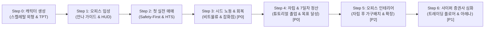

# 📋 사이퍼M (StockWars) 웹 데모 버전 완성 체크리스트

> **프로젝트명**: 사이퍼M (StockWars)  
> **문서 위치**: `Docs/DEMO_CHECKLIST.md`  
> **문서 목적**: 튜토리얼 진행 시나리오(온보딩 ➔ 첫 매매 ➔ 비트 물류 노동 ➔ 7일 정산 ➔ 자립 후 인테리어) 및 심화 콘텐츠(사이퍼 증권사 내부 기능 완성)를 반영한 구현 및 QA 체크리스트  
> **스프레드시트 파일**: [`Docs/DEMO_CHECKLIST.csv`](file:///c:/Users/Administrator/Documents/GitHub/StockWars/Docs/DEMO_CHECKLIST.csv)  
> **관련 기획서**: [CORE_GDD_04_FinancialInstitutions.md](file:///c:/Users/Administrator/Documents/GitHub/StockWars/Docs/CORE_GDD_04_FinancialInstitutions.md), [CORE_GDD_10_TutorialSystem.md](file:///c:/Users/Administrator/Documents/GitHub/StockWars/Docs/CORE_GDD_10_TutorialSystem.md), [CORE_GDD_08_CharacterCreation.md](file:///c:/Users/Administrator/Documents/GitHub/StockWars/Docs/CORE_GDD_08_CharacterCreation.md), [part_separation_guide_512.md](file:///c:/Users/Administrator/Documents/GitHub/StockWars/docs/part_separation_guide_512.md)  
> **최종 수정일**: 2026-09-20  

---

## 📌 중요도 & 상태 표기 범례 (Legend)

### 중요도 등급 (Priority)
| 중요도 등급 | 구분 | 설명 |
| :---: | :---: | :--- |
| 🔴 **P0** | **최우선 (Core)** | 핵심 게임 루프 및 데모 필수 구현 기능 (캐릭터 생성, HTS 매매, 비트 물류 노동, 7일 정산) |
| 🟡 **P1** | **중요 (Major)** | 게임의 완성도 및 심화 금융 시스템 (사이퍼 증권사 객장/아레나, 메신저 찌라시, 타운 경제 시설) |
| 🟢 **P2** | **일반 (Polish/Post)** | 자립 후 오피스 인테리어, 비주얼 디테일, 사운드(SFX), 시간대 그래픽 연출 및 편의성 |

### 진행 상태 (Status)
| 상태 뱃지 | 구분 | 설명 |
| :---: | :---: | :--- |
| ✅ **완료** | Done | 개발 및 검증이 완료된 항목 |
| 🔄 **진행중** | In Progress | 핵심 기능/프로토타입은 구현되었으나 에셋/폴리싱이 추가 진행 중인 항목 |
| ⏳ **대기** | To Do | 개발 시작 전 대기 상태인 항목 |

---

## 🗂️ 튜토리얼 & 심화 콘텐츠 구현 로드맵

---

## 📊 종합 진척 현황 요약

| 단계 | 구분 | 총 항목 수 | ✅ 완료 | 🔄 진행중 | ⏳ 대기 | 진척률 (완료 기준) |
| :---: | :--- | :---: | :---: | :---: | :---: | :---: |
| **Step 0** | 👤 트레이더 등록 & 캐릭터 생성 | 4 | 3 | 1 | 0 | **75%** (기능 100%) |
| **Step 1** | 🏢 오피스 입성 & 기본 조작 | 5 | 4 | 0 | 1 | **80%** |
| **Step 2** | 📈 첫 실전 매매 & HTS 거래소 | 5 | 5 | 0 | 0 | **100%** |
| **Step 3** | 📦 시드머니 노동 & 기력 회복 `[P0]` | 5 | 4 | 0 | 1 | **80%** |
| **Step 4** | 🎓 자립 & 7일차 주간 월세 정산 `[P0]` | 5 | 3 | 0 | 2 | **60%** |
| **Step 5** | 🪑 오피스 인테리어 & 확장 `[P2]` | 3 | 0 | 0 | 3 | **0%** |
| **Step 6** | 🏛️ 사이퍼 증권사 내부 & 심화 시스템 | 10 | 5 | 0 | 5 | **50%** |
| **전체** | **합계** | **37** | **24** | **1** | **12** | **64.9%** |

---

## 📋 단계별 세부 구현 체크리스트 (Table Format)

### [Step 0] 👤 트레이더 등록 & 캐릭터 생성 (Character Creation & TPT)
> 플레이어의 고유 2D 스켈레탈 아바타 외형 및 투자 성향(TPT) 확립, 출입증 발급 연출

| ID | 중요도 | 작업 항목 | 진행 상태 | 시작일 | 종료일 | 세부 구현 내용 및 명세 |
| :---: | :---: | :--- | :---: | :---: | :---: | :--- |
| **0-1** | 🟡 P1 | **게임 타이틀 화면 (Title Screen)** | ✅ 완료 | 2026-09-15 | 2026-09-16 | 게임 로고, [새로운 시작/이어하기/데모/설정] 버튼, 실시간 티커 마퀴, 키오스크 전환 |
| **0-2** | 🔴 P0 | **2D 스켈레탈 아바타 커스텀 UI & 프리뷰** | 🔄 진행중 | 2026-09-14 | - | 2.5등신 22슬롯 스켈레탈 렌더러/UI 기능 구현 완료. 512x512 파츠 스프라이트 정밀 슬라이싱 및 에셋 매핑 고도화 진행 중 |
| **0-3** | 🔴 P0 | **투자자 성향 진단 테스트 (TPT)** | ✅ 완료 | 2026-09-15 | 2026-09-16 | 3가지 상황별 퀴즈 Q&A 인터랙션 UI, 4대 성향 판정 및 능력치 +1 블록 보너스 부여 |
| **0-4** | 🟡 P1 | **트레이더 출입증 발급 연출 (ID Card Ceremony)** | ✅ 완료 | 2026-09-15 | 2026-09-16 | 도트 프린터 효과음/텍스처, 닉네임/사진/성향 각인 출입증 슬라이드업, 초기 자금 5,000G 지급 및 오피스 전환 |

---

### [Step 1] 🏢 오피스 입성 & 기본 조작 (Office Orientation & HUD)
> 2.5D 아이소메트릭 오피스 기본 조작법, 시점 컨트롤 및 핵심 HUD 인지

| ID | 중요도 | 작업 항목 | 진행 상태 | 시작일 | 종료일 | 세부 구현 내용 및 명세 |
| :---: | :---: | :--- | :---: | :---: | :---: | :--- |
| **1-1** | 🔴 P0 | **아이소메트릭 옥상 스테이지 베이스 구축** | ✅ 완료 | 2026-09-12 | 2026-09-13 | 8x8 방바닥 타일, 문/창문, 글래스 빌딩 파사드 및 입체 베젤 베이스 완성 |
| **1-2** | 🔴 P0 | **안나 온보딩 가이드 (`AnnaTutorial.js`)** | ✅ 완료 | 2026-09-16 | 2026-09-17 | 전담 매니저 안나 포트레이트, 타자기 텍스트 다이얼로그 시스템, 초기 5,000G 입금 안내 및 HTS 열기 가이드 |
| **1-3** | 🟡 P1 | **기본 조작 가이드 & 시점 제어** | ⏳ 대기 | - | - | 캐릭터 WASD/마우스 클릭 이동 및 트레이딩 데스크 앞 지정 구역 이동 판정, 카메라 패닝/줌 컨트롤 |
| **1-4** | 🔴 P0 | **상단 기본 HUD & 금융 상태 바 (Main HUD)** | ✅ 완료 | 2026-09-13 | 2026-09-14 | 진행 일차(`Day N`), 실시간 24h 시계, 장중 상태(`09:00~15:30`), OpenWeather 날씨 연동, 자산 요약 헤더 |
| **1-5** | 🔴 P0 | **스마트폰 홈 스크린 & 앱 그리드 UI** | ✅ 완료 | 2026-09-13 | 2026-09-14 | `사이퍼M(HTS)`, `Bubble(메신저)`, `뉴스` 등 기본 앱 아이콘 및 배지 알림 UI, 슬라이드 토글 인터랙션 |

---

### [Step 2] 📈 첫 실전 매매 & HTS 거래소 (First Trading & Market Engine)
> HTS/주식 인터페이스 학습 및 첫 매수 체결(Safety-First)의 쾌감 전달

| ID | 중요도 | 작업 항목 | 진행 상태 | 시작일 | 종료일 | 세부 구현 내용 및 명세 |
| :---: | :---: | :--- | :---: | :---: | :---: | :--- |
| **2-1** | 🔴 P0 | **실시간 주가 변동 & 시세 엔진 (Market Engine)** | ✅ 완료 | 2026-09-13 | 2026-09-14 | 섹터별(IT/바이오/엔터/금융) 주가 변동 및 난수 파동 엔진 시뮬레이션, 1초 틱 갱신 및 가격 히스토리 |
| **2-2** | 🔴 P0 | **사이퍼M 주식 거래소 앱 (HTS)** | ✅ 완료 | 2026-09-13 | 2026-09-15 | 섹터 필터 칩, 검색/정렬, 종목 리스트 미니 스파크라인 차트, 5호가 호가창 및 수량 선택(+/-/MAX) |
| **2-3** | 🔴 P0 | **상세 인터랙티브 차트 모달** | ✅ 완료 | 2026-09-14 | 2026-09-15 | 실시간 캔들스틱 차트, 이동평균선(MA5, MA20), 거래량(Volume) 바, 크로스헤어 O/H/L/C 툴팁 |
| **2-4** | 🔴 P0 | **첫 1주 매수 튜토리얼 (Safety-First & Highlight)** | ✅ 완료 | 2026-09-16 | 2026-09-17 | 안나 추천 종목 안내 대사, 타겟 종목 하이라이트/펄스 연출, 1주 매수 실행 시 도트 체결 연출 및 피드백 |
| **2-5** | 🔴 P0 | **보유 포트폴리오(Portfolio) 실시간 연동** | ✅ 완료 | 2026-09-13 | 2026-09-14 | 보유 종목 목록, 보유 수량, 매수평단가, 현재가, 평가손익, 수익률 % 실시간 표시 |

---

### [Step 3] 📦 시드머니 노동 & 기력 회복 (Bit Logistics & Stamina Loop) `[🔴 최우선]`
> 초기 시드머니 확보를 위한 비트 물류 노동 미니게임과 스테미나 회복 사이클 구축 (Core Loop)

| ID | 중요도 | 작업 항목 | 진행 상태 | 시작일 | 종료일 | 세부 구현 내용 및 명세 |
| :---: | :---: | :--- | :---: | :---: | :---: | :--- |
| **3-1** | 🔴 P0 | **타운 외출 연계 & 물류센터 진입 가이드** | ✅ 완료 | 2026-09-20 | 2026-09-24 | 안나 첫 매수 후 외출 제안 연동, 오피스 문/상단바 타운 외출 인터랙션 및 타운 도착 시 비트 물류센터 진입 가이드(`AnnaTutorial`) 연동 완료 |
| **3-2** | 🔴 P0 | **비트 물류창고 & 관리소장 박씨 튜토리얼** | ✅ 완료 | 2026-09-22 | 2026-09-24 | 관리소장 박씨(Manager Park) 전용 VN 튜토리얼(`ParkLogisticsTutorial`) 및 상하차 알바 완료 시 안나 최종 졸업 축하 대사 연계 |
| **3-3** | 🔴 P0 | **60초 화물 운송 미니게임 (Side-View Physics)** | ✅ 완료 | 2026-09-22 | 2026-09-23 | 사이드뷰 화물 운송: A/D 이동, [Shift] 질주, [W / Space / 버튼] 수동 상자 집기/최대 4단 다중 스택, 좌측 트럭 적재함 하차 ➔ 빈손 귀환 루프, 파손 위험 게이지, 💡 박씨 가이드 버튼 |
| **3-4** | 🔴 P0 | **작업 정산 및 보상 체계** | ✅ 완료 | 2026-09-22 | 2026-09-22 | 60초 등급(S:800G/A:560G/B:320G/C:100G) 산정 및 골드/EXP 즉시 지급, 찌라시 보너스(30%), 황금 잭팟(0.002%) |
| **3-5** | 🔴 P0 | **스테미나 회복 루프 (비비안 잡화점)** | ✅ 완료 | 2026-09-25 | 2026-09-25 | 비비안 잡화점 내부 UI 및 NPC 비비안 인터랙션, 4대 매대 탭(일일/주간/비밀/서점), 에너지 드링크(500G) 구매/즉시 섭취 및 인벤토리 연동 완료 |

---

### [Step 4] 🎓 자립 & 7일차 주간 월세 정산 (Graduation & Settlement Flow) `[🔴 최우선]`
> 튜토리얼 졸업, 전체 시스템 자유 개방 및 첫 주간 생존 과제(5,000G) 완수

| ID | 중요도 | 작업 항목 | 진행 상태 | 시작일 | 종료일 | 세부 구현 내용 및 명세 |
| :---: | :---: | :--- | :---: | :---: | :---: | :--- |
| **4-1** | 🔴 P0 | **독립(Graduation) 완료 & UI 전체 락 해제** | ⏳ 대기 | - | - | 안나 졸업 축하 대사(`TUT_05_GRADUATION`), 정착 보너스 2,000G 지급 및 모든 UI/타운 시설 잠금 해제 |
| **4-2** | 🟡 P1 | **뉴스 & 찌라시(Bubble) 시스템 연동** | ✅ 완료 | 2026-09-13 | 2026-09-15 | 실시간 속보 뉴스/찌라시 피드 렌더링, 뉴스 상세 모달(`NewsDetailModal`) 및 즉시 매매 바로가기, 주가 파동 연동 |
| **4-3** | 🟡 P1 | **타운 주요 상업/경제 시설 연동** | ⏳ 대기 | - | - | 은행(적금/대출/압류), 증권사(수수료할인), 전당포(LTV 60%), 서점(리포트/교재), 가구/의상점, 펍(블랙잭) |
| **4-4** | 🔴 P0 | **Day +1 (다음 날 진행) 파이프라인** | ✅ 완료 | 2026-09-13 | 2026-09-14 | Day +1 클릭 시 장 마감 ➔ 밤 연출 ➔ 일차 가산 ➔ 다음 날 개장 정산, 7일간 월세 5,000G 목표 게이지/D-Day |
| **4-5** | 🔴 P0 | **7일차 성과 분석 리포트 UI (`SettlementModal`)** | ✅ 완료 | 2026-09-13 | 2026-09-15 | 자산/월세 계산, 최고/최대손실 종목 분석, 투자 성향 칭호, S/A/B/F 스탬프, 클리어/파산/조기파산 엔딩 분기 |

---

### [Step 5] 🪑 오피스 인테리어 & 확장 (Interior & Furniture Mode) `[🟢 자립 후 확장/서브]`
> 2.5D 아이소메트릭 가구 드래그 배치 및 회전 시스템 (자립 완료 후 나만의 오피스 커스텀)

| ID | 중요도 | 작업 항목 | 진행 상태 | 시작일 | 종료일 | 세부 구현 내용 및 명세 |
| :---: | :---: | :--- | :---: | :---: | :---: | :--- |
| **5-1** | 🟢 P2 | **인테리어 모드 (Edit Mode) & 바닥 그리드** | ⏳ 대기 | - | - | 인테리어 모드 토글 진입 ➔ 8x8 바닥 타일 배치 가이드 그리드 활성화 |
| **5-2** | 🟢 P2 | **가구 배치 및 90도 회전 시스템** | ⏳ 대기 | - | - | 가구 보관함 서랍(Drawer) 오픈 및 기본/구매 가구 드래그 배치, R키 90도 회전, 배치 확정 연출 |
| **5-3** | 🟢 P2 | **오피스 내부 데코레이션 가구 & 소품 추가** | ⏳ 대기 | - | - | 듀얼 모니터 HTS 데스크, 주식 차트 포스터, 화분, 책장 등 소품 오브젝트 배치 |

---

### [Step 6] 🏛️ 사이퍼 증권사 (Cipher Securities) 건물 & 심화 시스템 `[🟡 핵심 심화]`
> 증권사 2.5D 내부 씬(트레이딩 플로어, 거대 전광판, 아레나 배틀, VVIP 서밋 라운지) 및 고난도 시스템 구축

| ID | 중요도 | 작업 항목 | 진행 상태 | 시작일 | 종료일 | 세부 구현 내용 및 명세 |
| :---: | :---: | :--- | :---: | :---: | :---: | :--- |
| **6-1** | 🟡 P1 | **증권사 트레이딩 플로어 (Trading Floor) 객장 씬** | ⏳ 대기 | - | - | 증권사 2.5D 내부 공간, 거대 전광판(Big Board) 실시간 틱 시세판, 현장 매매 수수료 0.01% 우대 창구(vs 홈 0.15%) |
| **6-2** | 🟡 P1 | **프라이빗 트레이딩 아레나 (The Arena) ROI 배틀** | ⏳ 대기 | - | - | 참가비(100~5,000G) 스테이크 배틀, 200~300% 고변동성 예비 종목 풀 12종 스피드 매매 및 상금 독식 |
| **6-3** | 🟡 P1 | **VVIP 서밋 라운지 (Summit Lounge) & 기관 운용** | ⏳ 대기 | - | - | Lv.20/명성 5,000pt 해금, VVIP 전용 공매도 창구, 대규모 위탁 자금 운용(기관 투자) 및 횡령/적색수배 리스크 |
| **6-4** | 🟡 P1 | **증권사 객장 NPC & 현장 정보원 상호작용** | ⏳ 대기 | - | - | 객장 상주 트레이더 NPC 대화, 현장 독점 속보 및 고급 금융 찌라시 거래 시스템 |
| **6-5** | 🟡 P1 | **Lv.20 해금 토글 시스템** | ✅ 완료 | 2026-09-13 | 2026-09-14 | 데스크톱 상단 바 및 프로필 설정에서 Lv.20 모드 원클릭 해금/잠금 토글 |
| **6-6** | 🟢 P2 | **구름 두둥실 부유 애니메이션 (`.cloud-layer`)** | ✅ 완료 | 2026-09-12 | 2026-09-13 | CSS 키프레임 기반 부유 구름 레이어 애니메이션 |
| **6-7** | 🟢 P2 | **오디오 & 사운드 효과 (SFX)** | ⏳ 대기 | - | - | 객장 웅성거림 앰비언스, 버튼 터치음, 매수/매도 체결음, 장 마감/개장 벨소리, 도트 프린터 인쇄음 |
| **6-8** | 🔴 P0 | **시현용 데스크톱 컨트롤 바 연동** | ✅ 완료 | 2026-09-13 | 2026-09-14 | 타이틀 복귀, 전체 화면/스마트폰 뷰 전환, Lv.20 해금, Day +1, 7일차 정산, 리셋 버튼 |
| **6-9** | 🔴 P0 | **튜토리얼 마스크(Punch-through Mask) 및 예외 처리** | ⏳ 대기 | - | - | UI 타겟 펀칭 딤드 마스크, 야간/주말 가상 튜토리얼 호가 모드, TutorialStep 저장/복원 |
| **6-10** | 🔴 P0 | **반응형 뷰포트 & 데모 초기화 검증** | ✅ 완료 | 2026-09-14 | 2026-09-15 | 모바일 / 태블릿 / PC 브라우저 해상도별 레이아웃 깨짐 검증, 데모 초기화(Reset) 시 데이터 원복 테스트 |
