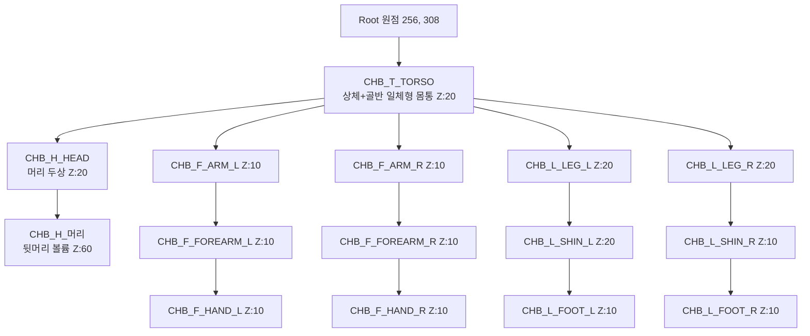
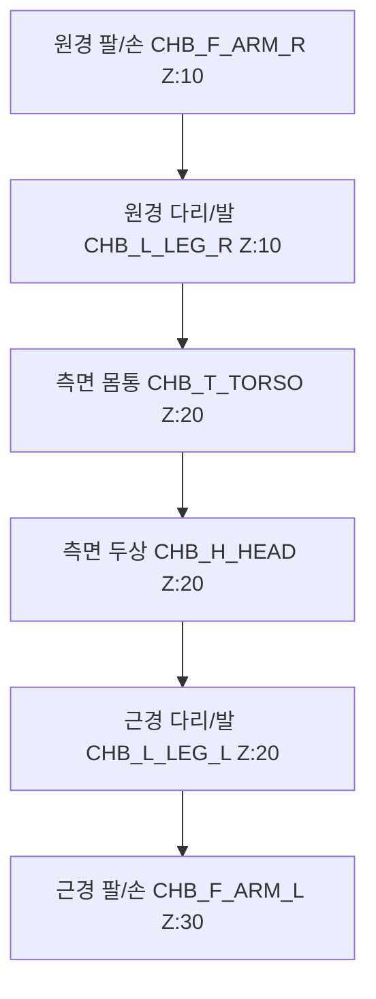

# StockWars 2D 스켈레탈 아바타 기본 바디 절단 및 파츠 분리 가이드 (512 x 512)
> **시스템 아키텍처:** 스파인(Spine) / 2D 스켈레탈 본 리깅 관절 분리 시스템 (정면 & 측면 가이드 v2.2)

본 문서는 StockWars의 2D 스켈레탈(Bone & Slot / Attachment) 관절 애니메이션을 위한 **치비 스타일 모듈형 기본 바디 절단 규격서(Base Body Slicing Guide - Front & Profile)**입니다.

---

## 📐 1. 캔버스 기본 규격 및 원칙

| 항목 | 규격 및 규칙 | 비고 |
| :--- | :--- | :--- |
| **캔버스 해상도** | **512 x 512 px** (정사각형 1:1) | 표준 생산 및 런타임 렌더링 규격 |
| **포맷** | **PNG-32 (Alpha 8-bit Transparent)** | 배경 투명 필수, 안티에일리어싱 포함 |
| **컬러 모드** | **RGB / 8-bit** | sRGB 프로파일 |
| **캐릭터 비율** | **2.5등신 SD Chibi (중성 체형)** | 머리: 42%, 몸통: 26%, 하체: 32% |
| **지면 기준선 (Ground)** | **Y = 480 px** | 캐릭터 발바닥 접지선 baseline |
| **수직 중심축 (Center X)** | **X = 256 px** | 정면(Front)의 좌우 대칭 기준선 |

---

## 🧩 2. 시점별 슬롯 체계 및 렌더링 순서 (Z-Index Matrix)

### 1) 정면 시점 (Front View)


### 2) 측면 시점 (Side Profile View - 좌/우)
측면에서는 **원경(Far, 뒤쪽 팔/다리)**과 **근경(Near, 앞쪽 팔/다리)**의 깊이 순서가 핵심입니다.



---

## 📋 3. 정면 / 측면 파츠별 슬롯 명세 및 관절 피벗 (총 13개)

| 파츠 ID | 정면(Front) 역할 | 측면(Profile) 역할 | 정면 Z | 측면 Z | 피벗 (Pivot) |
| :--- | :--- | :--- | :---: | :---: | :--- |
| **`CHB_H_HEAD`** | 머리 두상 (정면) | 머리 두상 (측면 프로필) | `20` | `20` | 목 결합부 |
| **`CHB_H_머리`** | 뒷머리 볼륨 (정면) | 뒷머리 볼륨 (측면) | `60` | `60` | 목 중심 |
| **`CHB_T_TORSO`** | 몸통 (상체+골반 정면) | 몸통 (상체+골반 측면 핏) | `20` | `20` | 척추/골반 중심 |
| **`CHB_F_ARM_L`** | 왼쪽 위팔 (상완) | 근경 위팔 (앞쪽 상완) | `10` | `30` | 어깨 관절 |
| **`CHB_F_FOREARM_L`** | 왼쪽 아래팔 (하완) | 근경 아래팔 (앞쪽 하완) | `10` | `30` | 팔꿈치 관절 |
| **`CHB_F_HAND_L`** | 왼쪽 손 | 근경 손 (앞쪽 손) | `10` | `30` | 손목 관절 |
| **`CHB_F_ARM_R`** | 오른쪽 위팔 (상완) | 원경 위팔 (뒤쪽 상완) | `10` | `10` | 어깨 관절 |
| **`CHB_F_FOREARM_R`** | 오른쪽 아래팔 (하완) | 원경 아래팔 (뒤쪽 하완) | `10` | `10` | 팔꿈치 관절 |
| **`CHB_F_HAND_R`** | 오른쪽 손 | 원경 손 (뒤쪽 손) | `10` | `10` | 손목 관절 |
| **`CHB_L_LEG_L`** | 왼쪽 허벅지 | 근경 허벅지 (앞쪽 대퇴) | `20` | `20` | 고관절 |
| **`CHB_L_SHIN_L`** | 왼쪽 종아리 | 근경 종아리 (앞쪽 하퇴) | `20` | `20` | 무릎 관절 |
| **`CHB_L_FOOT_L`** | 왼쪽 발 | 근경 발 (측면 발 모양) | `10` | `20` | 발목 관절 |
| **`CHB_L_LEG_R`** | 오른쪽 허벅지 | 원경 허벅지 (뒤쪽 대퇴) | `20` | `10` | 고관절 |
| **`CHB_L_SHIN_R`** | 오른쪽 종아리 | 원경 종아리 (뒤쪽 하퇴) | `10` | `10` | 무릎 관절 |
| **`CHB_L_FOOT_R`** | 오른쪽 발 | 원경 발 (측면 발 모양) | `10` | `10` | 발목 관절 |

---

## 🎨 4. 5종 스킨톤 표준 컬러 정의

| 스킨톤 ID | 명칭 | 메인 피부색 (#HEX) | 음영 컬러 (#HEX) |
| :--- | :--- | :---: | :---: |
| **`pale`** | **창백한 쿨톤** | `#FFF2EC` | `#E8C9BD` |
| **`fair`** | **밝은 웜 아이보리** | `#FFE5D4` | `#E5BAA1` |
| **`natural`** | **자연스러운 베이지** | `#F2C7A5` | `#D69E78` |
| **`tan`** | **골든 탠 (구릿빛)** | `#D89970` | `#B56F42` |
| **`deep`** | **딥 에스프레소** | `#784A33` | `#542E1C` |

---

## 📁 5. 파일 네이밍 및 폴더 구조

```
assets/character/rig/{skinTone}/
├── front/
│   ├── CHB_H_HEAD_front.png
│   ├── CHB_T_TORSO_front.png
│   ├── CHB_F_ARM_L_front.png / CHB_F_ARM_R_front.png
│   ├── CHB_F_FOREARM_L_front.png / CHB_F_FOREARM_R_front.png
│   ├── CHB_F_HAND_L_front.png / CHB_F_HAND_R_front.png
│   ├── CHB_L_LEG_L_front.png / CHB_L_LEG_R_front.png
│   ├── CHB_L_SHIN_L_front.png / CHB_L_SHIN_R_front.png
│   └── CHB_L_FOOT_L_front.png / CHB_L_FOOT_R_front.png
└── side/
    ├── CHB_H_HEAD_side.png
    ├── CHB_T_TORSO_side.png
    ├── CHB_F_ARM_L_side.png / CHB_F_ARM_R_side.png
    ├── CHB_F_FOREARM_L_side.png / CHB_F_FOREARM_R_side.png
    ├── CHB_F_HAND_L_side.png / CHB_F_HAND_R_side.png
    ├── CHB_L_LEG_L_side.png / CHB_L_LEG_R_side.png
    ├── CHB_L_SHIN_L_side.png / CHB_L_SHIN_R_side.png
    └── CHB_L_FOOT_L_side.png / CHB_L_FOOT_R_side.png
```
